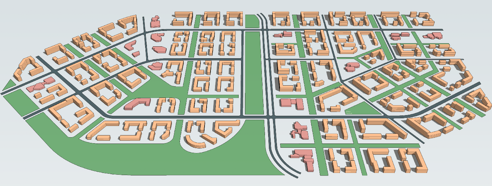
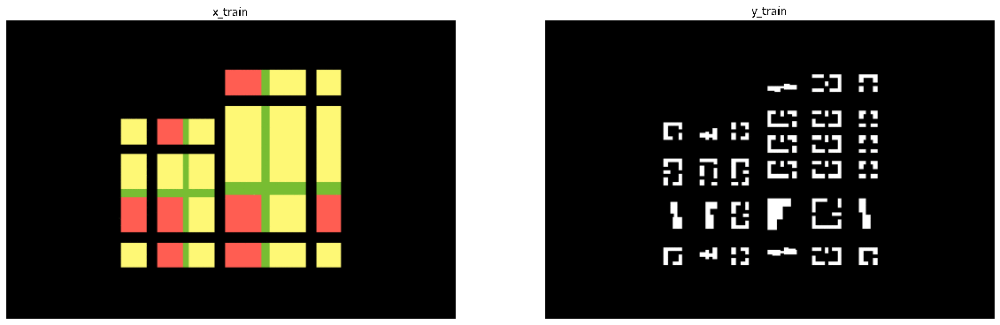
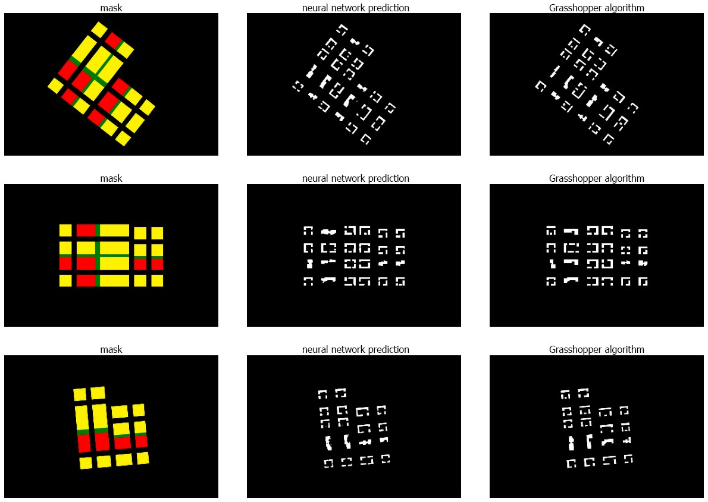
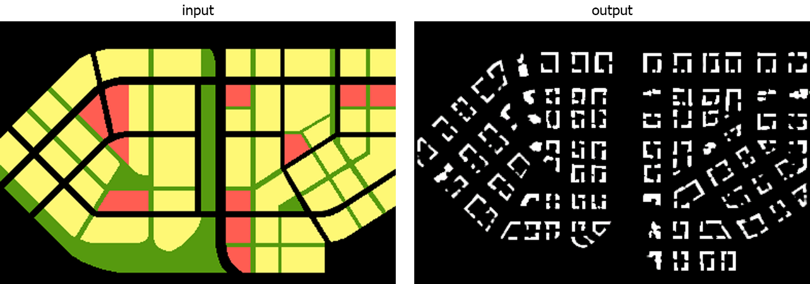

# <div align="center">Urban Planning GAN</div>
<p align="center"></p>

<p align="center"><a href="https://medium.com/geekculture/how-ai-can-help-urban-planners-to-create-city-concepts-c3ce7e7b063e" title="Zillow">Read the article on Medium.com</a></p>

The GAN model was developed in order to become a helping tool for urban planners to create city concepts.

The idea is to send a picture with functional zones of some area and get a layout of houses. Therefore, **Pix2Pix GAN** was choosen for the project.

<p align="center"></p>
<p align="center">Samples of X and Y pictures used in training</p>

# Training
In order to create a dataset for training a huge algorithm was written using <a href="https://www.grasshopper3d.com" title="Grasshopper">Grasshopper</a> for Rhinosceros 6 was used. 10000 images were exported and only few of them are available for public <a href="https://github.com/arthurkazaryan/urban_planning_gan/tree/main/data/images" title="samples">here.</a>

To preprocess the images and save them as numpy arrays, place images in ``./data/images`` folder and run script:

```sh
python urban_planning_gan/arrays.py
```

Before running training process make sure that numpy arrays are available at ``./data/arrays`` folder. Then, run the following script, where the first argument is the number of epochs, and the second is batch size:

```sh
python urban_planning_gan/train.py 100 8
```
 As as result, GAN models will be saved in ``./data`` folder.

 <p align="center"></p>
<p align="center">Comparison of NN prediction and algorithm.</p>

# Prediction

In order to predict simply use ``predict.py`` as following:

```sh
python urban_planning_gan/predict.py **PATH_TO_IMAGE**
```

The output image will be saved in a root directory with a prefix.

 <p align="center"></p>
<p align="center">An example of a predicted result.</p>
